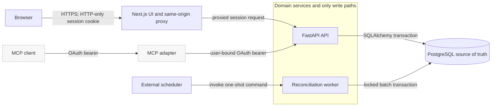
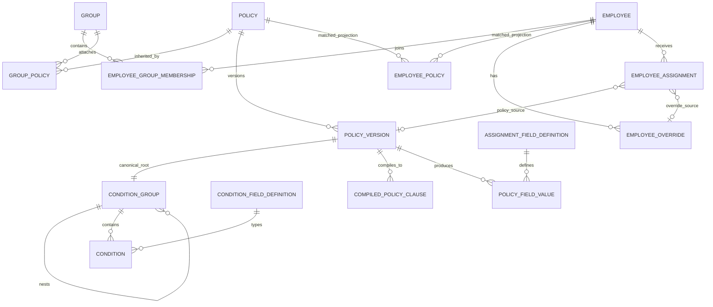

# PolicyOS system design

## 1. Executive summary

PolicyOS turns workforce rules into date-effective employee assignments. Administrators define policies over trusted employee, group, tenure, location, department, and reporting-tree facts; the system resolves those rules into values such as pay schedule or application access. It preserves both the resulting assignment and the evidence used to reach it.

The central abstraction separates definition from decision. A `Policy` is a stable identity. A `PolicyVersion` is an immutable date-effective behavioral definition containing a priority, condition tree, compiled clauses, and outputs; there is no version-update operation. Creating a later version makes one controlled boundary adjustment when it closes a prior open-ended range on the preceding day. `EmployeeAssignment` rows are materialized temporal decisions, and each stores an explanation snapshot with its provenance.

Correctness comes from explicit conflict rejection, transactionally shared mutation and reconciliation, ordered temporal writes, database constraints, and deterministic candidate ordering. The resolver never silently chooses between equal-priority, different values for a one-valued field. Preview and commit use the same domain services, so a preview exercises the same validation and fan-out as the real change.

The principal tradeoff is deliberate: material policy mutations reconcile affected assignments in the request transaction, and a material policy change conservatively considers every employee. This favors an atomic, inspectable state over maximum write throughput. Current reads are consequently simple and indexed; a later section describes how to move fan-out to an outbox-driven asynchronous pipeline without replacing the domain model.

## 2. Requirements mapped to implementation

| Warp criterion | Implemented mechanism |
|---|---|
| Rule definition | Catalog-backed static and derived condition fields form a canonical nested tree; the tree is compiled to OR-of-AND clauses by the [policy compiler](../backend/app/services/policy_compiler.py). |
| Any-date resolution | Past dates read recorded assignment intervals, today reads persisted open assignments, and future dates run the stateless [assignment resolver](../backend/app/services/assignment_resolution.py). |
| Cardinality | Assignment fields declare `one` or `many`; resolution and override services enforce the corresponding semantics. |
| Conflict handling | Highest priority wins for `one`; equal-priority different values raise a domain conflict and roll back the transaction. |
| Employee-attribute changes | Condition dependency metadata selects the changed employee and, for reporting facts, affected managers and subtrees. |
| Policy edits | New versions and lifecycle changes use the same authoring service, then synchronously reconcile the employee population. |
| Group membership changes | Membership changes reconcile that employee; group-policy attachment changes reconcile the group's members. |
| Future dates and tenure | Scheduled events represent policy boundaries and calculated tenure thresholds; a one-shot worker processes due batches. |
| Explainability | Every materialized assignment stores policy/override provenance, evidence, candidates, priorities, and the selection outcome. |
| Auditability | Domain writes and append-only audit entries share one database transaction. Assignment history answers a different question from the audit journal. |
| Non-engineer UX | The Next.js UI provides guided policy authoring, previews, conflict messages, explanations, history, groups, overrides, and audit exploration. |
| Developer extensibility | Trusted condition definitions separate rule-builder metadata from allowlisted resolvers and declare dependencies used for change impact. |

## 3. Architecture overview



FastAPI is the domain and authorization boundary; PostgreSQL is the durable source of truth. The browser never receives a backend bearer token: Next.js forwards its HTTP-only session cookie through a [same-origin proxy](../frontend/app/api/backend/%5B...path%5D/route.ts). MCP is secondary to the product path. It holds no domain data and forwards a user-bound OAuth credential to FastAPI, which applies the same permissions and visibility rules.

Only the API and reconciliation worker write domain data, both through the same services and database transactions. The worker is a scheduled/background path; ordinary mutations and their reconciliation are synchronous. The Compose `init` service separately owns schema migration and optional demo seeding.

## 4. Domain model



The [SQLAlchemy model](../backend/app/models.py) keeps stable policy identity separate from versioned behavior. A policy version owns a canonical condition tree for authoring and round-tripping, plus compiled clauses for evaluation. Compilation preserves meaning while turning a nested expression into a list of AND clauses joined by OR. Condition fields are system-controlled inputs with types, operators, UI metadata, resolver keys, and dependency metadata; administrators cannot upload executable expressions.

`AssignmentFieldDefinition` defines an output domain and either one- or many-valued cardinality. `PolicyFieldValue` normalizes outputs relationally, which makes candidates and sources queryable. Controlled fields validate values against declared options.

`GroupPolicy` is an authored association that supplies candidates to group members. `EmployeePolicy` is a replaceable projection of the policies currently matching an employee, and `EmployeeAssignment` is the materialized temporal decision projection. Direct condition matches and group origins converge before resolution. Each assignment has exactly one policy-version or override source and an immutable JSON explanation snapshot. `ScheduledReconciliation` records future work, while `AuditLog` records actors and mutations.

## 5. Resolution semantics

The [policy engine](../backend/app/services/policy_engine.py) resolves in this order:

`employee facts and reporting context → effective policy versions → direct and group matches → field candidates → cardinality resolution → manual overrides → temporal result → explanation snapshot`

For a `one` field, candidates are ordered by descending priority and ascending policy-version ID. The highest priority wins only when all candidates at that priority agree on the value. Equal-priority different values are a configuration conflict, not a tie-break; the mutation or projection fails with structured conflict metadata.

For a `many` field, all unique values are combined. When multiple policies produce the same value, PolicyOS retains one source: highest priority first, then lowest version ID. This affects provenance, not the visible set.

Overrides run after policy resolution. Any active override for a field replaces every policy-derived value for that field and can supply a value when no policy does. The policy engine resolves first, so an override does not conceal a policy conflict. Rejecting ambiguity is deterministic: the same inputs always produce either the same assignments or the same explicit conflict, and an administrator must resolve the unsafe configuration.

## 6. Time model

Policy-version ranges are date-based and inclusive: `effective_from <= date <= effective_until`; a null end is open-ended. Gaps are permitted. Assignment history uses UTC timestamp intervals that are half-open: `[effective_from, effective_until)`. The database rejects reversed or zero-length assignment intervals, and reconciliation rejects writes earlier than existing history.

The read mode is explicit:

- A past date reads recorded assignment history at midnight UTC for that date.
- Today reads persisted, open assignments.
- A future date calculates assignments without changing policy links, assignments, schedules, or audit rows.

Future calculation uses current employee facts and active overrides together with future-effective policy versions and tenure evaluated on the requested date. Employee attributes, reporting relationships, group membership, and overrides are not independently versioned or future-dated. Therefore a future result is a projection under today's non-policy facts, and a historical policy impact cannot be reconstructed against past employee facts that were never recorded. Assignment history remains authoritative for what was actually materialized.

Policy boundaries and tenure transitions become reconciliation timestamps at midnight UTC. An inclusive policy expiration is scheduled at the start of the following day.

## 7. Reconciliation and change propagation

```mermaid
sequenceDiagram
    actor Admin
    participant API as FastAPI/domain services
    participant DB as PostgreSQL
    participant R as Resolver

    Admin->>API: Preview employee or policy change
    API->>DB: BEGIN SAVEPOINT; apply real mutation services
    API->>R: Resolve impacted employees
    R-->>API: Desired assignments or conflict
    API->>DB: ROLLBACK SAVEPOINT
    API-->>Admin: Differences and conflicts
    Admin->>API: Submit mutation
    API->>DB: Write definition/fact and select impact set
    API->>R: Resolve desired state
    API->>DB: Keep equal open rows
    API->>DB: Close removed/changed rows; insert replacements
    API->>DB: Insert audit records; COMMIT
```

The [reconciliation service](../backend/app/services/reconciliation.py) calculates all employees in a batch at one instant. It locks open assignments, keeps rows whose value, source, and stable explanation are unchanged, closes removed or changed rows, and inserts replacements. A material explanation change therefore creates history even if the displayed value and source are unchanged. The evaluation date is excluded from equality so clock-only changes do not churn history.

| Trigger | Reconciled population | Timing |
|---|---|---|
| Employee scalar change | Changed employee when a condition dependency names that column | Synchronous |
| Start-date change | Changed employee; tenure events are resynchronized | Synchronous plus scheduled thresholds |
| Manager change | Moved employee/subtree and old/new managers, as declared by dependencies | Synchronous |
| Group membership change | Added or removed employee | Synchronous |
| Group-policy attachment | Current members of that group | Synchronous |
| Policy creation, version, or lifecycle change | All employees, conservatively | Synchronous |
| Policy effective-date boundary | All employees for the affected policy | Scheduled worker |
| Tenure threshold | The affected employee | Scheduled worker |

Preview uses a nested transaction/savepoint and then rolls it back. Because it calls the same employee, policy, group, override, matching, and reconciliation services, validation and conflict behavior do not have a second implementation.

## 8. Correctness invariants

| Invariant | Enforcement |
|---|---|
| At most one effective version per policy/date; no overlapping ranges | Application service checks under a row lock on `Policy`; resolution also fails closed if duplicate effective versions exist. PostgreSQL checks each range is internally valid. |
| Deterministic version numbering | The policy row is locked before reading the maximum version number; `(policy_id, version_number)` is unique. |
| Exactly one assignment source | PostgreSQL check requires either a policy-version source or an override source, never both or neither. |
| Valid half-open history | PostgreSQL requires end greater than start; service ordering, open-row locks, and chronological-write rejection preserve the timeline. |
| Acyclic reporting graph | Foreign key plus application checks reject missing managers, self-reference, and cycles. |
| Cardinality and values | Pydantic restricts cardinality; resolver enforces one/many behavior; override service enforces counts and uniqueness; value service validates controlled options. |
| Preview/commit parity | Preview invokes the production domain services in a rollback-only savepoint. |
| Atomic audit | Audit rows and domain/reconciliation changes use the request or worker transaction. |
| Idempotent schedules | A database unique key covers entity, entity ID, trigger, and timestamp; cancelled events can be restored. |
| Exclusive worker claims | A PostgreSQL advisory lock limits active workers; due rows use `FOR UPDATE SKIP LOCKED`. |

These are intentionally split between database constraints and service invariants. For example, PostgreSQL validates each assignment row, while service-level locking and ordering establish its relationship to prior rows.

## 9. Explainability and auditability

Assignment history says **what was true** during an interval. An explanation snapshot says **why that particular decision was made**. The audit log says **who changed the system, what changed, and when**.

A policy explanation includes the winning policy/version, direct condition evidence and group origins, candidate values and priorities, selected/duplicate/lower-priority outcomes, field cardinality and strategy, and evaluation date. An override explanation identifies the override and the policy values it replaced. The employee UI renders these stored details, including competing candidates, through the [explanation components](../frontend/app/employees/%5Bid%5D/_components/assignment-card/assignment-explanation.tsx).

Snapshots are stored rather than regenerated because policies, group origins, employee facts, and candidate sets can later change. Regeneration would explain today's model, not the historical decision. Snapshots are never updated in place; history list responses omit their payload for compactness, while current, point-in-time, and projected detail reads expose it.

## 10. User experience

The UI exposes the risk-bearing workflows without requiring users to understand the storage model: guided policy authoring and lifecycle control, impact preview, employee onboarding and attribute-change preview, group and override management, assignment explanations, historical investigation, and filterable audit exploration.

Previews surface assignment differences before a write. Conflict messages stop ambiguous one-valued configurations. Explanations make priority and origin behavior visible. Separate permissions for drafting, versioning, activation, and archiving keep policy construction distinct from making it effective. These controls reduce risk but do not replace backend authorization; FastAPI remains authoritative for permissions, employee scope, and assignment-field visibility.

## 11. Infrastructure choices and tradeoffs

PostgreSQL supplies transactions, referential integrity, row/advisory locking, JSON support, and indexed temporal reads. SQLAlchemy centralizes mappings and transactions; Alembic alone owns schema changes. FastAPI provides typed HTTP contracts around explicit services. Next.js owns presentation and the secure same-origin proxy. A separate one-shot worker keeps scheduled work out of API startup and allows an external scheduler to control cadence.

Normalized rows hold policies, clauses, values, projections, and assignments; JSON is limited to flexible catalog metadata, audit before/after data, and immutable explanation snapshots.

Key alternatives and decisions:

- **Evaluate on every read:** rejected for current state because it makes latency and conflict discovery read-dependent; materialization gives fast, stable reads and history.
- **Event sourcing:** temporal assignment rows plus an audit journal meet current investigation needs with less replay and projection complexity.
- **Graph database:** recursive PostgreSQL queries are sufficient for a single-manager hierarchy and keep transactions local.
- **Executable rule expressions:** trusted condition definitions and allowlisted resolvers trade arbitrary flexibility for validation, dependency tracking, and safety.
- **Fully asynchronous reconciliation:** synchronous writes give immediate atomic correctness at the present scale; policy fan-out is the known scaling boundary.
- **JSON-only rule DSL:** a canonical relational tree supports validation and round-trip authoring, while compiled relational clauses make execution explicit.

## 12. Scaling characteristics

Today, employee changes use dependency metadata to narrow impact. Group membership changes reconcile one member, and group-policy changes reconcile group members. Material policy changes conservatively scan all employees. Batch resolution deduplicates IDs but evaluates employees individually, and policy previews can run a population-wide simulation. Scheduled events are claimed in bounded locked batches. Read-heavy current-assignment queries benefit from materialized rows and employee/current indexes.

The policy-edit path does not scale indefinitely. A credible next stage is:

1. Commit the policy version and an outbox/reconciliation-generation record atomically.
2. Derive candidate employees from indexed condition dependencies, retaining a conservative fallback.
3. Process idempotent employee batches asynchronously.
4. Track generation progress, failures, and conflicts.
5. Compare and publish assignment changes atomically per employee or batch.
6. Keep synchronous previews for bounded populations; make large previews asynchronous.
7. Add benchmarks, queue-depth/latency metrics, tracing, and failure dashboards before choosing thresholds.

None of the outbox, queue, generation tracking, or asynchronous policy fan-out exists today; this is an evolution path, not a production claim.

## 13. Failure handling and operations

Conflicts raise exceptions and roll back domain changes, reconciliation, schedules, and audit writes together. Each worker batch is its own transaction. If it fails, its scheduled events remain pending; the process exits unsuccessfully for an external scheduler to retry. The [worker](../backend/app/workers/reconciliation.py) uses a PostgreSQL advisory lock, while event selection uses `FOR UPDATE SKIP LOCKED`. Unique event identities and idempotent catalog/demo seeding make safe retries possible.

Alembic migrations must run before application startup. The [database startup check](../backend/app/database.py) compares the database revision with the repository migration head and fails with an instruction to run `alembic upgrade head`; it never calls `create_all`. In the [Compose stack](../compose.yaml), PostgreSQL must be healthy, `init` applies migrations and optional seed data, and runtime services wait for `init` to finish successfully. Health checks and startup ordering expose initialization failures rather than hiding schema drift.

## 14. Current boundaries

- The data model represents one workspace; it has no explicit SaaS tenant partition.
- Material policy changes and their previews can synchronously scan the full employee population.
- Employee facts, org relationships, and group membership have no independent historical versions or scheduled future changes.
- Overrides have no effective range, reason, author field, approval, or review workflow. Dispatch constants exist for future override events, but schedule creation is not implemented.
- There is no outbox, queue, cache, reconciliation-generation tracker, or production scheduler bundled with the application. Compose only wraps the one-shot worker in a demo polling loop.
- Benchmark and operational-observability evidence is limited; no throughput or population ceiling is claimed.
- Authentication is local plus first-party OAuth for MCP; external identity-provider federation is not implemented.
- Historical assignment results are preserved, but retroactive recomputation against historical employee facts is not supported.

## 15. Why this design

PolicyOS chooses correctness before optimization: explicit conflicts instead of silent ambiguity, stored provenance instead of reconstructed explanations, and one set of domain services for preview and commit. Materialized temporal assignments make present and historical decisions easy to query. The same model can evolve toward asynchronous, dependency-indexed fan-out without changing the resolver's semantics or discarding its explanation and audit guarantees.
